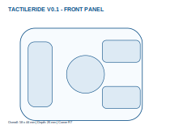

# TactileRide V0.1 Blueprint Sources

## Status and scope

These user-supplied V0.1 sources are a **preliminary reference for a stationary
ergonomic mock-up and bench prototype**. They record one possible control face,
rough packaging envelope, draft wiring diagram, and provisional BOM. They are
not final CAD, a production PCB, a printable release, a vehicle installation
design, or evidence of weather, vibration, certification, Android, or road-use
performance.

This folder does not select a board, GPIO map, or device-side pairing-reset
behavior. It records design input only; it does not change the decisions in the
ADRs or add a firmware requirement.

## Canonical editable sources

| Artifact | Purpose | Status |
| --- | --- | --- |
| [Control coordinates](TactileRide_V0.1_Control_Coordinates.csv) | One proposed 58 x 44 mm control-face layout. | Ergonomic hypothesis only |
| [Front-panel diagram](TactileRide_V0.1_Front_Panel.svg) | Vector reference for that layout. | Not a manufacturing drawing |
| [OpenSCAD reference model](../../../mechanical/prototypes/v0.1/TactileRide_V0.1_Reference_Model.scad) | Parametric static mock-up starting point. | Not a final enclosure or printable release |
| [Wiring reference](../../../electronics/prototypes/v0.1/TactileRide_V0.1_Wiring.svg) | One draft five-input and battery concept. | Not an approved schematic or GPIO assignment |
| [Provisional BOM](../../../electronics/bom/v0.1/TactileRide_V0.1_Provisional_BOM.csv) | Candidate envelopes and unresolved parts. | Not a purchase or production BOM |

### Front-panel preview

This visualises the proposed layout only. Refer to the coordinate CSV for its
editable dimensions and do not use the image as a fabrication drawing.

## Important conflicts and boundaries

- The wiring graphic labels inputs D0 through D4. It is **not** firmware pin
  configuration, a board selection, a reviewed schematic, or tested wiring.
- The supplied PDF snapshot describes a volume-button pairing-reset gesture.
  No such behavior is adopted in this repository; a future implementation must
  make a separate, reviewed decision.
- The 58 x 44 x 26 mm envelope, 22.5 mm clamp bore, XIAO nRF52840 allocation,
  and battery envelope are reference dimensions only. Measure the intended bar,
  clearances, reach, clutch travel, cables, and switchgear before any mock-up.
- The materials, gasket, switch, battery, and clamp descriptions are open
  design questions. They do not establish sealing, battery, clamp, or durability
  performance.

Follow the controlled, non-riding boundaries in [Safety](../../SAFETY.md) and
the static-mock-up evidence requirements in [the test plan](../../TEST_PLAN.md).

## Asset disposition and provenance

The canonical sources above were supplied from the local
`tactile-ride-assets/TactileRide_V0.1_Blueprint_Pack` directory on 2026-07-17.
No separate licence grant for the supplied assets has been verified; reuse is
subject to the repository's pending licence decision.

| Supplied artifact | Repository disposition | Reason |
| --- | --- | --- |
| Blueprint PDF and ZIP | Not tracked | Generated snapshots duplicate the editable source set and include unadopted instructions. |
| Generated STL | Not tracked | Derived from the OpenSCAD source and not a validated printable release. |
| Concept PNG | Not tracked | It contains unsupported claims, including weather resistance, long battery life, and an IPX target. |

## Before advancing V0.1

1. Measure the actual handlebar diameter and free clamping width.
2. Record left-thumb reach, full-lock, clutch-lever, cable, tank, phone-mount,
   and switchgear clearances while stationary.
3. Select and document switch, board, battery, protection, charging, and
   firmware-input decisions before treating the wiring diagram as actionable.
4. Define a controlled static ergonomic protocol before drawing conclusions from
   the control layout.
